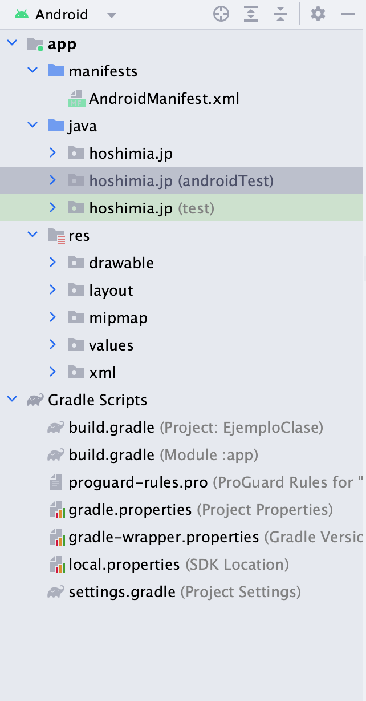
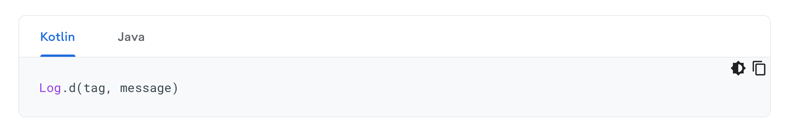
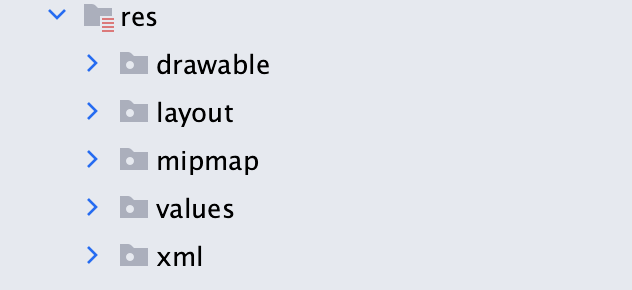
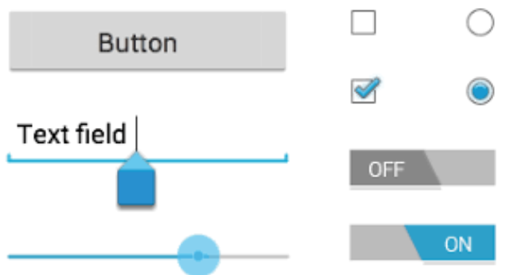
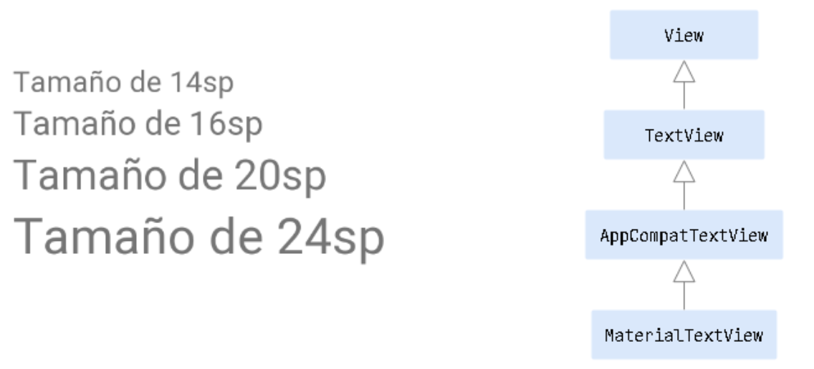
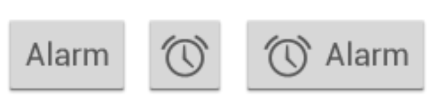
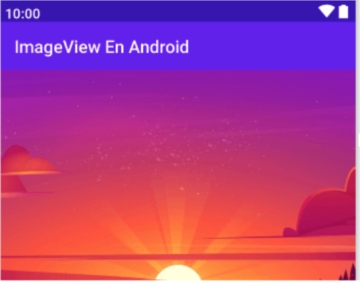

# Principios de Android. 📱


## Estructura de un proyecto 🏛

Cada proyecto de Android Studio incluye uno o más módulos con archivos de código fuente y archivos de recursos. Entre los tipos de módulos se incluyen los siguientes:

- Módulos de apps para Android
- Módulos de biblioteca
- Módulos de Google App Engine

Cada módulo de app contiene las siguientes carpetas:

- ***manifests***: contiene el archivo AndroidManifest.xml.
https://developer.android.com/guide/topics/manifest/manifest-intro?hl=es-419 
- ***java/kotlin***: contiene los archivos de código fuente Java, incluido el código de prueba de JUnit.
-***res***: contiene todos los recursos sin código, como diseños XML, strings e imágenes de mapa de bits.




<p align="right">
    
</p>

## Gradle

Build Tool; construye código de compilación de manera automática
- Utiliza lenguaje Groovy junto a Kotlin DSL.
- Crea el sistema de archivos del proyecto
- Ayuda a integrar dependencias.
- Automatiza el proceso de compilación.
- Genera el APK (ejecutable)

## Archivos de configuración.

build.gradle: 
- Dependencias
- Compilación
- Empaquetado (APK)

settings.gradle:
- Repositorios de búsqueda de dependencias

Otros: local.properties, gradle.properties

## Sync
Cada que hacemos cambios en los archivos de configuración, el IDE lo detecta y exige que hagas la sincronización del proyecto con los archivos para aplicar los cambios en toda la aplicación


## Herramientas de desarrollo.🔧

Las herramientas de software comúnmente utilizadas cumplen el objetivo de facilitar, optimizar y mejorar el desempeño de nuestro trabajo.

Las herramientas que nos ofrece Android estudio son:
- Emulador
- Logs 
- Depurador

### Logs 📝
La ventana Logcat de Android Studio muestra los mensajes del sistema, por ejemplo, cuando se produce la recolección de elementos no utilizados, y los mensajes que agregas a tu app con la clase Log. Se muestran los mensajes en tiempo real y se conserva un historial para que puedas ver los mensajes más antiguos.

A fin de mostrar solo la información de interés, puedes crear filtros, modificar la cantidad de información que se muestra en los mensajes, establecer niveles de prioridad, mostrar los mensajes generados únicamente por el código de la app y realizar búsquedas en el registro.

La prioridad es uno de los siguientes valores:

+ **v**: Registro detallado (prioridad más baja)
+ **d**: Depuración
+ **i**: Información
+ **w**: Advertencia
+ **e**: Error

Ventana de *Logcat*.


1. **Clear Logcat** : Haz clic en esta opción para borrar el registro visible.
2. **Scroll to the end** : Haz clic en esta opción para saltar a la parte inferior del registro y ver los últimos mensajes. Si luego haces clic en una línea del registro, se detendrá el desplazamiento de la vista en ese punto.
3. **Up the stack trace  y Down the stack trace**: Haz clic en estas opciones para navegar hacia arriba y hacia abajo por los seguimientos de pila del registro, y selecciona el nombre de archivo anterior o siguiente que aparece en las excepciones impresas. Este comportamiento es el mismo que se genera cuando haces clic en un nombre de archivo del registro.
4. **Use soft wraps** : Haz clic en esta opción para habilitar el ajuste de línea y evitar el desplazamiento horizontal. Sin embargo, es posible que las strings no separables sigan requiriendo un desplazamiento horizontal.
5. **Print** : Haz clic en esta opción para imprimir los mensajes de Logcat. Una vez que hayas seleccionado tus preferencias de impresión en el cuadro de diálogo que aparece, podrás elegir guardar los mensajes como PDF.
6. **Restart** : Haz clic en esta opción para borrar el registro y reiniciar Logcat. A diferencia del botón Clear Logcat, este botón recupera y muestra los mensajes anteriores del registro, de modo que es muy útil si Logcat no responde y no quieres perder los mensajes.
7. **Logcat header** : Haz clic en esta opción para abrir el diálogo Configure Logcat Header, donde puedes personalizar la apariencia de los mensajes de Logcat, por ejemplo, si quieres que se muestren la fecha y la hora.
8. **Screen capture** : Haz clic en esta opción para tomar una captura de pantalla.
9. **Screen record**: Haz clic en esta opción para grabar un video del dispositivo durante un máximo de 3 minutos.




Más información [aquí](https://developer.android.com/studio/debug/am-logcat?hl=es-419).


### Depurador 🐞

Android Studio proporciona un depurador que te permite realizar las siguientes acciones y más:

- Seleccionar un dispositivo en el cual depurarás tu app

- Establecer interrupciones en tu código Java, Kotlin y C/C++

- Examinar variables y evaluar expresiones en el tiempo de ejecución

**Step Over**: Con ella ejecutaremos la sentencia actual de nuestro código en la que estamos detenidos en ese momento.

**Step Into**: Al seleccionar esta opción nos moveremos a la siguiente línea de código. Eso sí, hay que tener en cuenta que esta línea de código sería la que tendría nuestra aplicación si estuviera escrita en un único bloque secuencial, sin llamadas a funciones o métodos de clase.

**Step Out**: Se ejecutará la función actual completa y volveremos a la línea que realizó su llamada para poder continuar depurando.


# Diseño de interfaces gráficas 📊 👨🏻‍💻

## Recursos de la aplicación. 🧮 🔧
Directorio **res** (resources)
- **Drawable**: gráficos (mapas de bits) cómo íconos, imágenes, gifs, etc.
- **Layout**: archivos .xml con la estructura de las pantallas.
- **Mipmap**: mapas de bits: íconos de inicio de la app.
- **Values**: administración de recursos: texto, traducciones, estilos, temas, colores, medidas, etc.




## ViewGroup and View 🗾

- ***View***: elementos a mostrar en la pantalla
- ***ViewGroup***: agrupa views en pantalla, sus propiedades afectan a todo el grupo.

```xml
<ConstraintLayout>
	<Button/>
	<ImageView/>
	<TextView/>
</ConstraintLayout>
```

## Layouts ⚜️

### LinearLayout 📈

Organiza los componentes uno seguido del otro de manera vertical u horizontal.


### RelativeLayout 🛟
Para organizar elementos “flotantes” o no estructurados.
La visualización es por referencias.


### ConstraintLayout 🔶

Organización por restricciones entre vistas.
La forma moderna  y más cómoda de diseñar vistas (en la mayoría de casos).


# Componentes básicos 🏷🌁

La interfaz de usuario de tu app es todo aquello que el usuario puede ver y con lo que puede interactuar en ella. Android ofrece una variedad de componentes de IU previamente compilados, como objetos de diseño estructurados y controles de la IU que te permiten compilar la interfaz gráfica de usuario para tu app.



## Texto 📚

Es un widget que muestra texto al usuario como su nombre lo sugiere. Claramente esto lo hace ser uno de los views más usados en interfaces de usuario para proyectar cabeceras, títulos, texto informativo, etiquetas y muchos otros.



## Botones ⏬

Un botón consiste en un texto o un ícono (o ambos) que comunica la acción que ocurrirá cuando el usuario lo toque.



## Imágenes 🌉
En Android para mostrar imágenes en la interfaz de tus aplicaciones, a partir de recursos drawables o elementos de la clase Bitmap.

Aprender los fundamentos sobre este widget te permitirá enriquecer tus layouts con imágenes para logos, fotos de galerías, miniaturas de elementos de listas, animaciones y mucho más.



## Manejo de eventos 🎰
Al considerar los eventos dentro de tu interfaz de usuario, el enfoque consiste en capturar los eventos desde el objeto de vista específico con el que interactúa el usuario. La clase View proporciona los medios para hacerlo.

Un objeto de escucha de eventos es una interfaz de la clase View que contiene un solo método de devolución de llamada.

En las interfaces de los objetos de escucha de eventos, se incluyen los siguientes métodos de devolución de llamada:

- onClick()
- onLongClick()
- onFocusChange()
- onKey()
- onTouch()
- onCreateContextMenu()

# Ciclo de vida de una App 🔁📱

Cuando un usuario navega por tu app, sale de ella y vuelve a entrar, las instancias de Activity de tu app pasan por diferentes estados de su ciclo de vida. La clase Activity proporciona una serie de devoluciones de llamada que permiten a la actividad saber que cambió un estado, es decir, que el sistema está creando, deteniendo o reanudando una actividad, o finalizando el proceso en el que se encuentra.

Por ejemplo, una buena implementación de las devoluciones de llamada de un ciclo de vida puede ayudar a garantizar que tu app:

- No falle si el usuario recibe una llamada telefónica o cambia a otra app mientras usa la tuya.
- No consuma recursos valiosos del sistema cuando el usuario no la use de forma activa.
- No pierda el progreso del usuario si este abandona tu app y regresa a ella posteriormente.
- No falle ni pierda el progreso del usuario cuando se gire la pantalla entre la orientación horizontal y la vertical.

