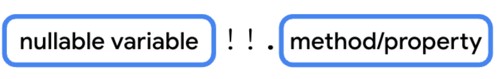
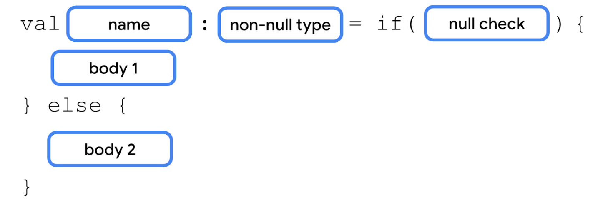
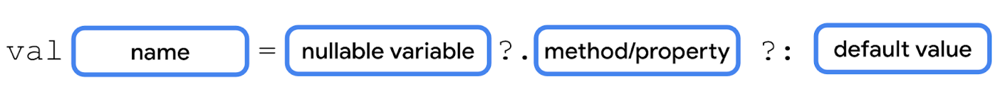

# Kotlin básico 🔖🐶📱

## Variables y constantes

Las **variables** como su propio nombre lo dice estas varian a lo largo del código y puden tener cambios durante su misma ejecución. Para Kotlin está la palabra reservada ***var***.

Las **constantes** son las que no van a cambiar su valor respecto al tiempo de ejecución en el código. Para Kotlin está la palabra reservada ***val***.

La **inferencia de dato** se refiere a que una variable podemos asignar el valor que sea y Kotlin automáticamente lo detecta. Sin embargo, la mejor práctica para estos casos es especificar el tipo de dato que se sigue de la siguiente sintaxis:

```
<var o val> <nombre> : <tipoDeDato>  = <Valor>
```

Por ejemplo:

```kotlin
var edad: Int  = 24

```

## Tipos de datos. 📕

De los principales se pueden resumir en los siguientes:


|Tipo de dato de Kotlin| Qué contiene|
|:--------------------:|:-----------:|
|**String**| Texto|
|**Int**| Número entero|
|**Double**|Número decimal|
|**Float**|Número decimal (que es menos preciso que un **Double**). Tiene un *f* o *F* al final del número|
|**Boolean**|**true** o **false**. Usa este tipo de datos cuadno haya dos valores posibles|

Hablando de la inferencia de tipo en este caso en los float se encuentra con una *f* al final:

```kotlin
fun main(){
    var total = 35.4f //Es una forma 
    total = 520.2F //Otra forma
}
```
Podemos imprimir el valor de la función arriba de diferentes formas, por ejemplo:

```kotlin
fun main(){
    var total = 35.4f //Es una forma 
    total = 520.2F //Otra forma
    println(total) //Imprime la variable
    println("El total es de: $total") //Otra forma
    println("El total es de: "+total) //Otra forma
}
```
# Seguridad Nula. 🔓

En unas clases previas habíamos visto que podemos asignar valores a variables constantes y que estos pueden o no cambiar a lo largo del programa. Sin embargo, ¿Qué pasa si tenemos que nuestra variable o constante no obtenga ningún valor? Si no le damos un valor a nuestra variable o constante y corremos el programa de Kotlin tendremos un gran problema ya que dará errores al momento de ejecutarse. No obstante, podemos darles valores *null* a lo que se refiere que no recibe ningún tipo de valor.

```kotlin
fun main(){
    val Nombre: String = "Fabian" //Constante con un valor String
    val NombreNull = null
    println(NombreNull)
}
```
Si enviamos a imprimir el valor de **NombreNull** tendremos el siguiente resultado:
    
    null
Pero **ojo**👁‍🗨: **NO PODEMOS ASIGNAR VALORES *null* A VARIABLES NO NULABLES**. Ejemplo:
```kotlin
fun main(){
    var Nombre: String = "Athenas"
    Nombre = null
}
```
Ya que responderá con el siguiente mensaje: *Null can not be a value of non-null type String*. Sin embargo, para "evadir" este error podemos hacer que las variables no nulables sean nulas en su declaración. Esto quiere decir que, si tenemos valores dentro de nuetra variables pueden o no ser nulas. Para ello necesitamos de este operador ```?```.

```kotlin
fun main(){
    var cancionFavorita: String? = "Little Date"
    println(cancionFavorita)
    cancionFavorita = null
    println(cancionFavorita)
}
```
El resultado será el siguiente:

    Little Date
    null

Igualmente podemos hacerlo con un entero por ejemplo.
```kotlin
fun main(){
    var id: Int? = 10923
    println(id)
    id = null
    println(id)
}
```
El resultado será el siguiente:

    10923
    null
Para enviar a llamar a los métodos en Kotlin se usa el operador ```.``` algo que se verá más adelante. Sin embargo, vamos emplear algunos métodos de la parte de liberia de **String** que viene por defecto cuando corremos un playground.

```kotlin
fun main() {
    var cancionPlay: String = "Hatsukoi"
    println(cancionPlay.length)
}
```
*cancionPlay.length* nos imprimirá el número de caracteres que tiene la cadena *cancionPlay*.
    
    8

Imagina que deseas que la variable cancionPlay sea *anulable*, de manera que ninguna canción se esté reproduciendo y puedan asignarla a *null*. 

Para acceder a la propiedad *cancionPlay* anulable, cambiamos la estructura del dato pero si enviamos a imprimir nos marcará error:

```kotlin
fun main() {
    var cancionPlay: String? = "Hatsukoi"
    println(cancionPlay.length)
}
```

    Only safe (?.) or non-null asserted (!!.) calls are allowed on a nullable receiver of type String?

Kotlin aplica reglas sintácticas de forma intencional para lograr la seguridad de *null*, que hace referencia a una garantía de que no se realizarán llamadas accidentales en variables *null*. Esto no significa que las variables no pueden ser *null*. Significa que, si se accede a un miembro de una variable, la variable no puede ser *null*.

Esto es fundamental porque, si se intenta acceder a un miembro de una variable *null* ( conocido referencia *null*) durante la ejecución de una app, esta fallará porque la variable *null* no contiene ninguna propiedad ni método. Este tipo de falla se conoce como error de tiempo de ejecución, ya que el error ocurre después de que se compila y se ejecuta el código.

En este ejemplo, el código falla en el tiempo de compilación porque no se permite la referencia directa a la propiedad length para la variable cancionPlay debido a que existe la posibilidad de que la variable sea *null*.

Existen formas para trabajar con *null*.
### 1.  Operador de llamada segura ```?.```.
Puedes usar el operador de llamada segura ```?.``` para acceder a métodos o propiedades de variables anulables.


Para usar el operador de llamada segura ```?.``` a fin de acceder a un método o una propiedad, agrega un símbolo ```?``` después del nombre de la variable y accede al método o a la propiedad con la notación ```.```.

Aplicando lo visto en el anterior parrafo al ejemplo de la canción tenemos que:

```kotlin
fun main() {
    var cancionPlay: String? = "Hatsukoi"
    println(cancionPlay?.length)
}
```
El resultado:

    8

En el caso que *cancionPlay* fuera nulo tendríamos el siguiente resultado:

```kotlin
fun main() {
    var cancionPlay: String? = null
    println(cancionPlay?.length)
}
```

    null

### 2. Operador de aserción no nulo de ```!!```

También puedes usar el operador de aserción ```!!``` no nulo para acceder a métodos o propiedades de variables anulables.



Después de la variable anulable, debes agregar el operador de aserción ```!!``` no nulo seguido del operador . y, luego, el método o la propiedad sin espacios. En este caso si la usas significa que confirmas que el valor de la variable **no es null**, sin importar si lo es o no.

A diferencia con el primero, este puede generar un error llamado **NullPointerException** cuando la variable sí es *null*. Especialmente se usa este operador cuando el programador sabe que si su variable es  100% no nula, sino producirá ese error.

Volvamos al ejemplo anterior, cuando *cancionPlay* no es nula, veremos que sí ejecuta correctamente el tamaño del String.

```kotlin
fun main() {
    var cancionPlay: String? = "Hatsukoi"
    println(cancionPlay!!.length)
}
```
    8

Pero si es nulo:

```kotlin
fun main() {
    var cancionPlay: String? = null
    println(cancionPlay!!.length)
}
```
    Exception in thread "main" java.lang.NullPointerException 
    at FileKt.main (File.kt:4) 
    at FileKt.main (File.kt:-1) 
    at jdk.internal.reflect.NativeMethodAccessorImpl.invoke0 (:-2) 

Más adelante se hablará de las condicionales **if/else**, pero es importante abordar un ejemplo con ello usando *null*

```kotlin
fun main() {
    var cancionPlay: String? = "Hatsukoi"
    if (cancionPlay!=null){
        println("Reproduciendo: $cancionPlay")
    }else{
        println("Reproductor detenido")
    }
}
```
    Reproduciendo: Hatsukoi

Esto es útil por ejemplo al llenar formularios y que el usuario  no ingresó un nombre o un dato y regresar un mensaje de advertencia.

Podemos simplicar código usando esta estructura de usar un **if/else** y además una verificación de **null**.



```kotlin
fun main() {
    var cancionPlay: String? = "Hatsukoi"

    val tamanoNombreCancion = if (cancionPlay!=null){
        cancionPlay?.length
    }else{
        -1
    }
    println("El tamaño de carcateres en la cancion $cancionPlay son $tamanoNombreCancion")
}
```

El -1 es como un *return* si no se puede aplicar la propiedad o método. 

### 3. Operador Elvis ```?:```. 🎸

Si la variable no es *null*, se ejecuta la expresión antes que el *operador Elvis* ```?:```. Si la variable es *null*, se ejecuta la expresión después del *operador Elvis* ```?:```.



Si quitamos las condicionales del anterior ejemplo y nada más usamos el  *operador Elvis* tenemos el mismo resulado.

```kotlin
fun main() {
    var cancionPlay: String? = "Hatsukoi"
    val tamanoNombreCancion =cancionPlay?.length?:-1
    println("El tamaño de carcateres en la cancion $cancionPlay son $tamanoNombreCancion")
}
```
    El tamaño de carcateres en la cancion Hatsukoi son 8

**Dato curioso** 👀: El *operador Elvis* ```?:``` tiene el nombre de Elvis Presley, la estrella del rock, ya que se asemeja a un emoticón de su copete cuando se ve de costado.

# Arreglos 💐

# Listas 📝

# Mapas 🗺️

# Set 💿
