# Kotlin y AndroidStudio 📱
## POO 🚗

# Introducción a Android Studio 📝
Para correr nuestras aplicaciones usamos un IDE patrocinado con Jetbrains pero usado por Google. Las nuevas versiones en Android Studio han evolucionado hasta llegar hacer cinemáticas en las aplicaciones. En este curso veremos lo necesario para conocer Android Studio.

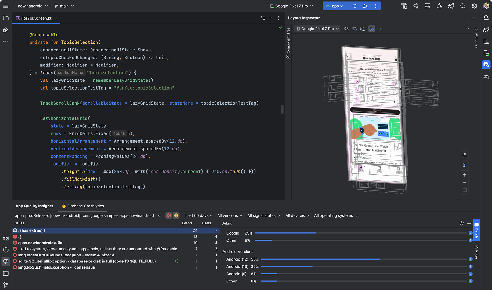

### Instalación. 🔧

Para la instalación de Android Studio es ir a la [página oficial](https://developer.android.com/studio), en estas fechas está la versión Flamingo. Sin embargo, si algo no les funciona podrán descargar versiones anteriores [aquí](https://developer.android.com/studio/archive?hl=es-419).

Ahora, hay una diferencia entre SDK (Kit de desarrollo de software), JDK (Java Development Kit) y una API (Interfaz de programación de aplicaciones). Las primeras dos es para desarrollar una aplicación de manera que tendremos los paquetes necesarios para desarrollarla. Sin embargo, una API no puede hacer un desarrollo como tal, sino que podemos usar ciertas herramientas para una interfaz gráfica lo más robusta posible.

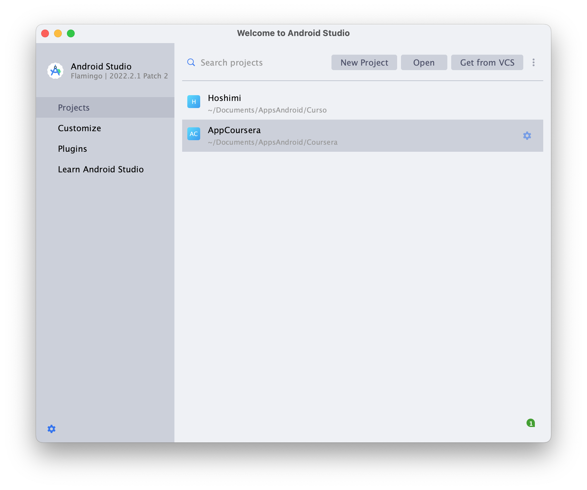

### Empezamos 🏌🏼‍♂️
Para crear un nuevo proyecto tendremos que dar Click en *New Project* y tendremos lo siguiente 

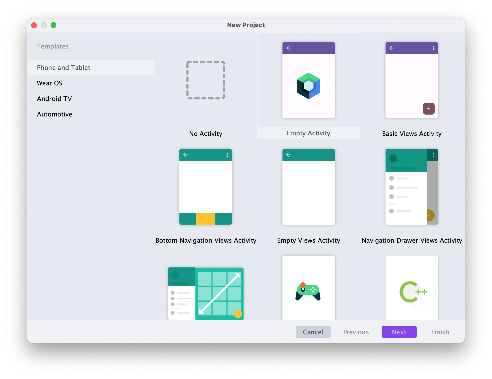

En la cual vemos que aparece varias plantillas, entre ella para el desarrollo de video juegos, también para aplicar liberirias de C/C++. Para empezar seleccionamos donde dice *Empty View Activity*. A continuación nos aparecerá los siguiente:

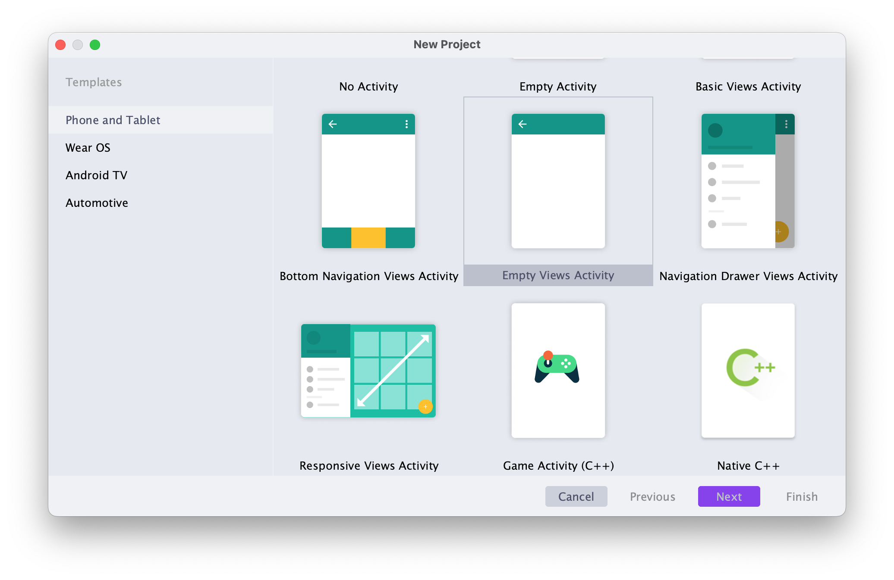

Una vez realizado el punto anterior nos pedirá los siguientes datos:
- **Nombre**: El nombre de su aplicación.
- **Package name**: El package name es el *id* o identificador una vez que se quiera subir a la PlayStore que identificará a su aplicación en ello puede ir el nombre de la compañia de desarrollo o si son independientes puede ir otro *id*.
- **Save location**: La localización donde quieren que se guarde sus proyecto(s).
- **Language**: En este caso la versión Flamingo ya no está *Empty Activity* con lo cual se escoge esta opción si el desarrollador quiere hacer su aplicación con Kotlin o Java.
- **Minimum SDK**: El SDK como platicabamos con anterioridad el también la compatibilidad de los dispositivos que trabajamos o en lo que estará disponibles, en este caso vemos en la siguiente tabla se muestra la compatbilidad en dispositivos:

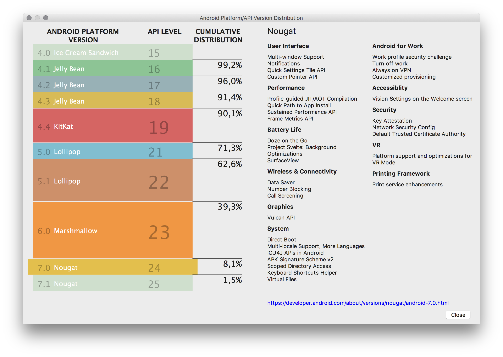

En este caso escogemos el que está por defecto *API 25: Android 7.1.1 (Nougat)*.

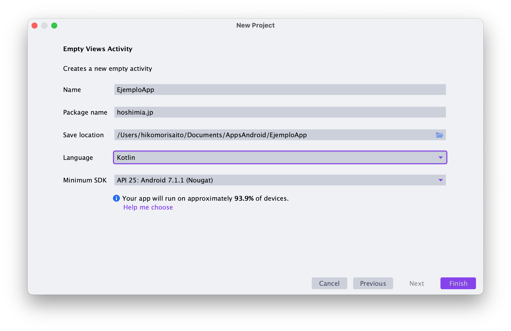

Una vez finalizado empezará a cargar nuestro proyecto por lo cual 
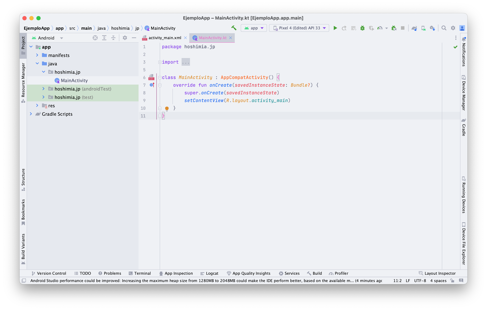

Una vez crado el proyecto hablemos de las funcionalidades de Android Studio.

## AVD vs Dispositivo físico 📱 vs 🖥

En el **AVD** es un dispositivo virtual o un simulador de un celular que en sus ventajas es que los niveles de seguridad en de un celular físico. Sin embargo, la mayor desventaja es que es muy pesado llegando con el SDK y el AVD instalado llegando a pesar con 7 GB de almacenamiento y además que gasta demasiados recursos al momento de ejecurtarse, en este caso si tienen un dispositivo que pueda soportarlo se puede usar de manera regular. 

En la parte de los dispositivos físicos se tiene que configurar en la forma de *modo de desarrollador*. Existe dos forma de conectarse por USB o WIFI nada más activando el modo de depuración USB o WIFI. Lo que se ve en la parte superior en dispositivos AVD se muestran los dispositivos físicos y virtuales.

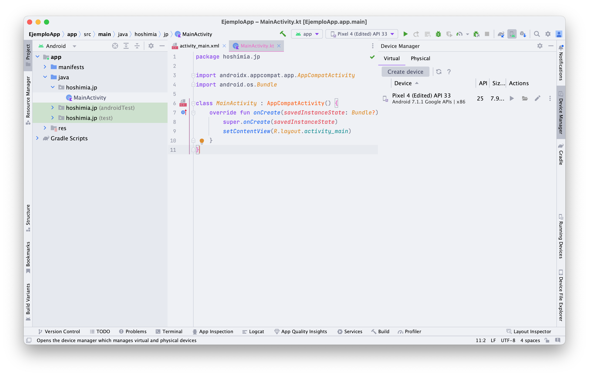

Para crear un dispositivo virtual se sigue de los siguientes pasos: 
- Es en dar click *Create vritual device*
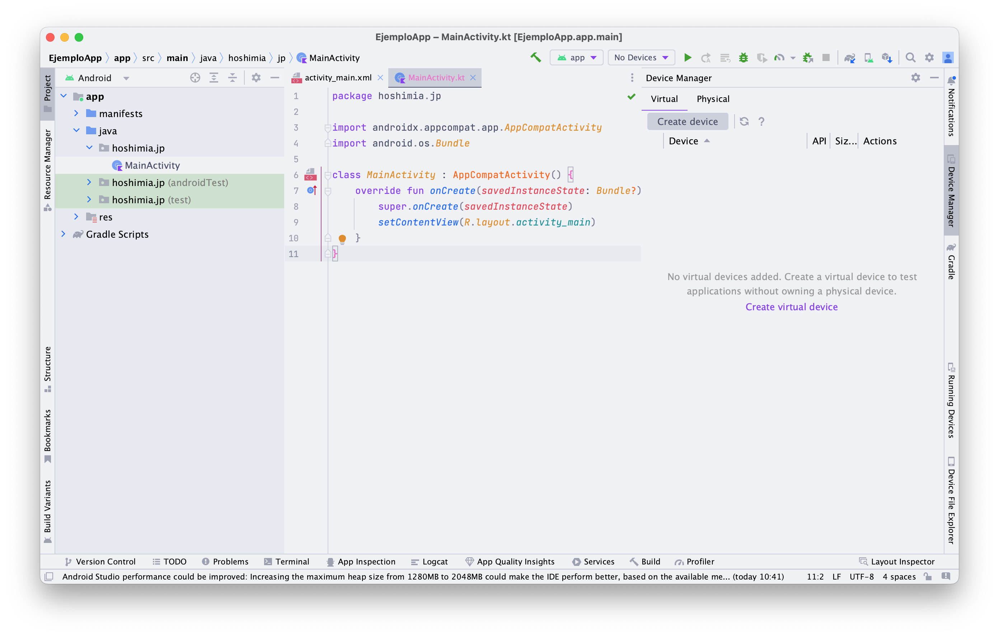
- Después nos aparecerá el dispositivo que queremos clonar en este caso va depender de las carácteristicas que necesitemos si y de sus funcionalidades. 
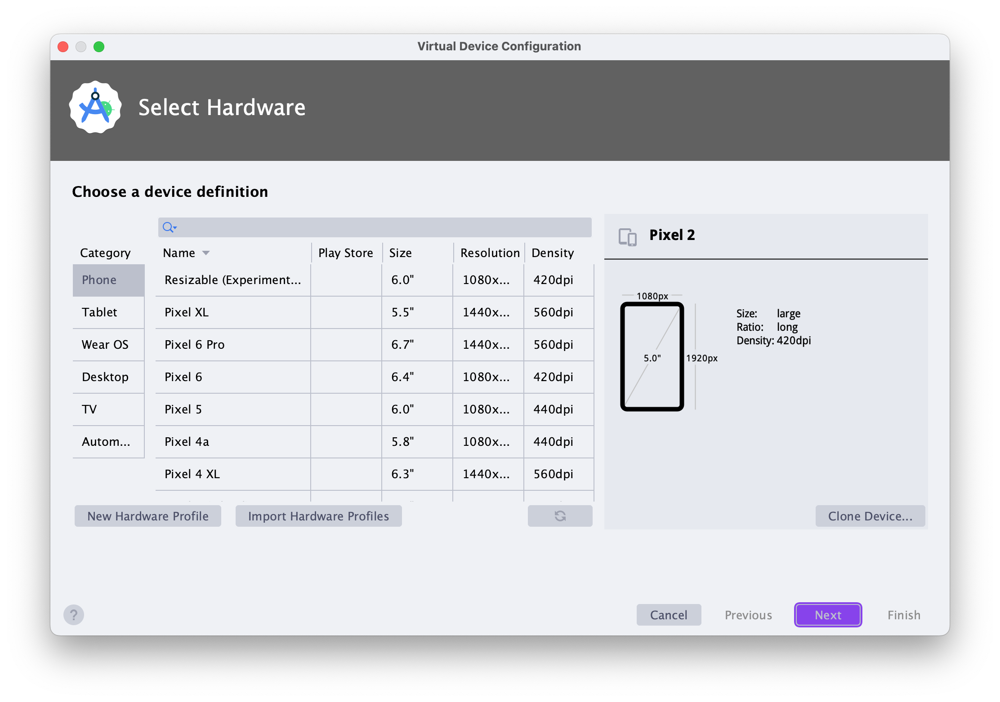
- Sigue la imagen del sistema operativo, como habíamos hablado con anterioridad dependerá para qué versión de SO (sistema operativo ) vayamos a realizar nuestra aplicación.
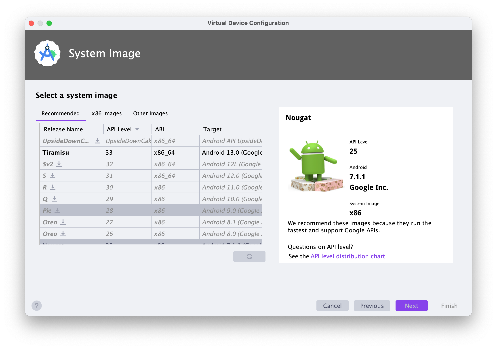
- Finalmente, podemos asignarle un nombre al dispositivo y con ello damos en click en *finish*.
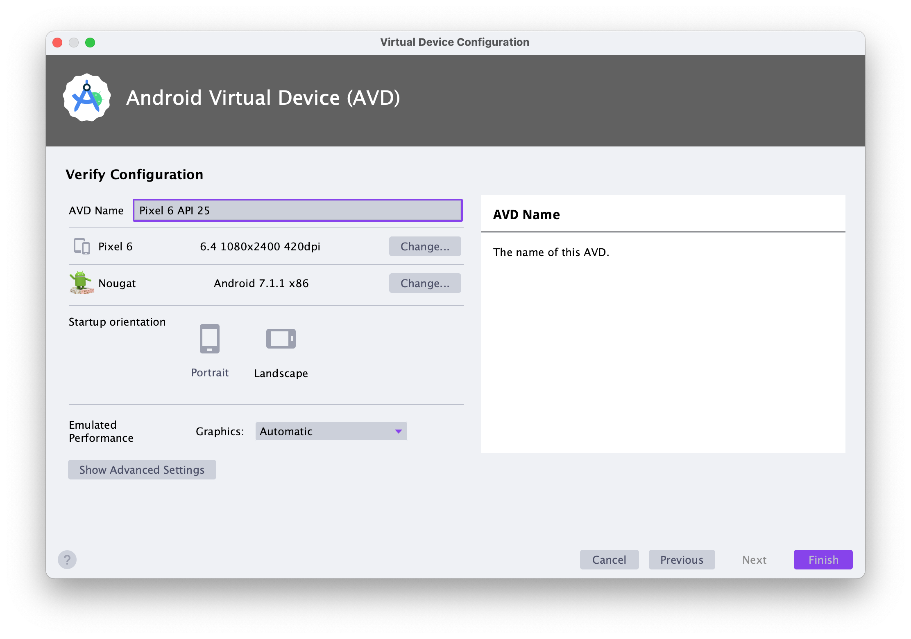
